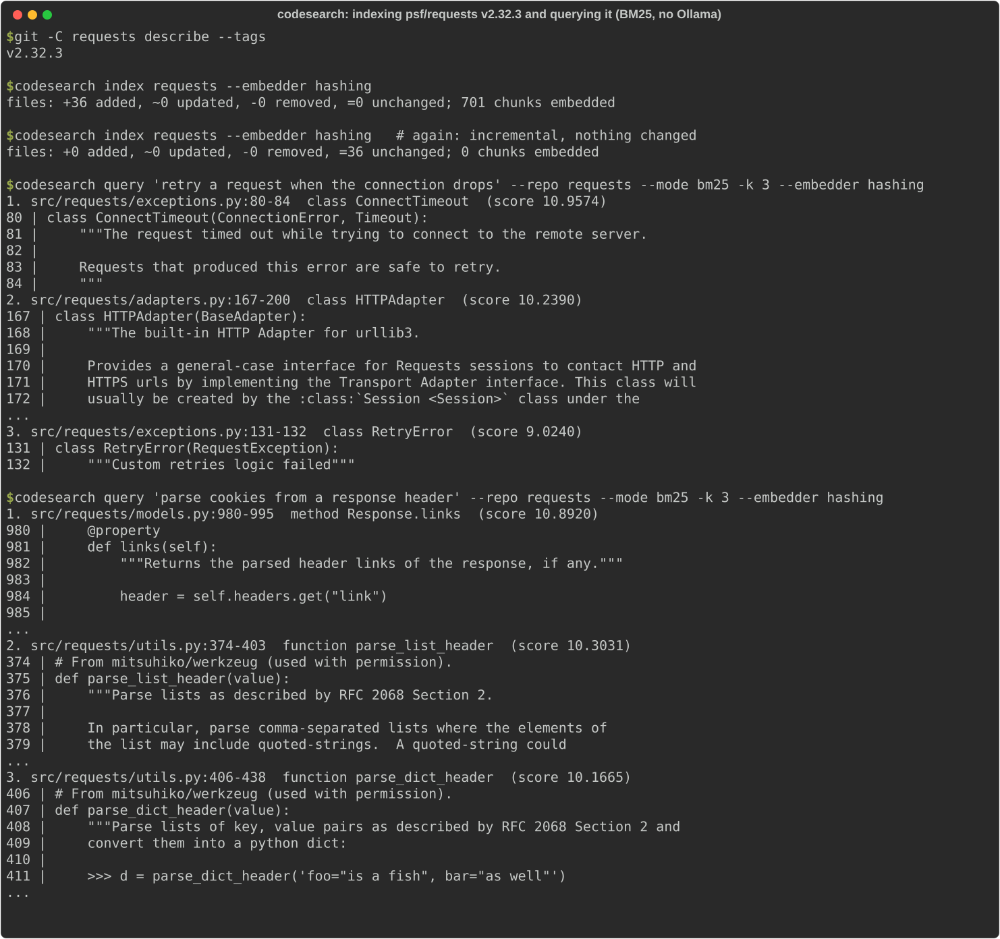

# code-search

> **Credits.** Built by Amaan Mithani with Claude (Anthropic) as the AI coding assistant.

Semantic search over a codebase: **tree-sitter chunking**, **BM25 over split
identifiers**, **dense retrieval** with a local Ollama embedding model, **hybrid
fusion** by reciprocal rank, and an optional **cross-encoder rerank**. The
evaluation is built so the numbers mean something: pinned repos, docstrings
stripped from the index, bootstrap confidence intervals.

```text
$ codesearch query "retry a request when the connection drops" --mode hybrid -k 3 \
    --repo data/repos/requests --index-dir data/index/requests-ollama-nomic-embed-text
 1. src/requests/adapters.py:613-719  method HTTPAdapter.send  (score 0.0325)
        613 |     def send(
        614 |         self, request, stream=False, timeout=None, verify=True, cert=None, proxies=None
        615 |     ):
        616 |         pass
            ...
 2. tests/test_requests.py:2645-2652  function test_urllib3_retries  (score 0.0315)
       2645 | def test_urllib3_retries(httpbin):
       2646 |     from urllib3.util import Retry
            ...
 3. src/requests/adapters.py:495-534  method HTTPAdapter.get_connection  (score 0.0272)
```

That run used the evaluation index, where docstrings have been replaced by `pass`
(see below). Snippets are shortened here.

## See it running



*Local run, 2026-09-26, on an unmodified clone of `psf/requests` v2.32.3 (docstrings kept, so this is not the evaluation index). Ollama isn't available on this machine, so the index was built with the test `hashing` embedder and only `--mode bm25` is shown. Dense, hybrid and rerank results need the real embedding model. Output is unedited, weaker hits included.*

## How it works

### Chunking (`src/codesearch/chunking.py`)

Files are parsed with tree-sitter (Python, Go, TypeScript/TSX). Each
function, method, class and type becomes one chunk with its file path, the
enclosing class (for methods, and the receiver type for Go methods) and a
1-based line span:

- **Functions and methods** are whole chunks, including decorators and directly
  attached comments (Go and JSDoc doc comments live there).
- **Classes** get a header chunk: the signature, docstring and class-level
  attributes up to the first member. Methods are separate chunks, so a
  2,000-line class does not become one unsearchable blob.
- **Nested functions** stay inside their parent. They are rarely useful hits
  on their own, and splitting them out would cut the parent in pieces.
- **Everything else at the top level** (imports, constants, `__main__`
  blocks) is collected into one `module` chunk per file.

BM25 and the embedder both see `"<path> <kind> <Class.method>"` followed by the
code, so the path and the qualified name count as evidence.

### Index (`src/codesearch/index.py`)

A SQLite file under `<repo>/.codesearch/` holds files (with SHA-256), chunks
and their float32 vectors. Re-indexing is incremental:

- Files whose content hash is unchanged are skipped, changed files are
  re-chunked, and deleted files are dropped.
- Embeddings are cached by `sha256(model, chunk text)`. Editing one function in
  a large file re-embeds only that function.
- Changing the embedding model or the chunker version rebuilds the index.

### Retrieval (`src/codesearch/search.py`)

| mode | what it does |
|---|---|
| `bm25` | Okapi BM25 (k1=1.2, b=0.75). Identifiers are split on camelCase, snake_case, acronyms and digits, and indexed both whole and as sub-words, so `getHTTPResponse` matches "http response". A tiny English stopword list is applied. |
| `dense` | Cosine similarity against `nomic-embed-text` vectors from Ollama, with the model's `search_document:` / `search_query:` prefixes. Brute-force matrix product, which is fine at this scale (thousands of chunks). |
| `hybrid` | Reciprocal-rank fusion (k=60) of the top 100 from each retriever. RRF uses only ranks, so BM25 scores and cosines need no calibration. |
| `hybrid+rerank` | The top 20 hybrid candidates are rescored by `cross-encoder/ms-marco-MiniLM-L-6-v2`, run through ONNX Runtime (about 90 MB, no PyTorch), with query and code truncated to 256 tokens. The rest keep their fused order below the reranked head. |

The embedder and reranker are protocols (`Embedder`, `Reranker`). Tests use a
deterministic hashing embedder and a token-overlap reranker, so the test suite
never calls the network or loads a model.

## Evaluation

There is no labelled query set for these repos, so the benchmark is built from
their docstrings (`src/codesearch/benchmark.py`). CodeSearchNet was not
downloaded.

1. Two well-documented repos are cloned at pinned commits into the gitignored
   `data/` directory: `psf/requests` v2.32.3 and `pallets/click` 8.1.7. All
   `.py` files are indexed, including tests and examples, which act as
   distractors.
2. Every function or method chunk whose docstring has at least 8 words gives
   one pair. The query is the docstring's first sentence, with reST roles such
   as ``:func:`x` `` reduced to `x`. The single relevant target is that
   function's chunk.
3. **All function and class docstrings are stripped from the indexed code.**
   Each is replaced by `pass` plus blank lines, so line spans stay valid.
   Queries that still appear verbatim anywhere in the indexed text are dropped,
   and a test asserts that none survive. Queries whose text maps to more than
   one function (copy-pasted docstrings) are also dropped, since they would
   have several correct answers.
4. For each mode, the eval reports MRR@10 and Recall@1/5/10 (with one relevant
   item, recall@k is hit@k). Brackets give 95% percentile-bootstrap CIs from
   2,000 resamples of queries. It also reports p50 retrieval latency and a
   *paired* bootstrap of the MRR@10 difference between modes. Per-mode CIs
   overlap a lot, and the paired test is the right way to ask whether one mode
   beats another on the same queries.
5. Query embeddings and cross-encoder scores are cached in
   `data/cache/models.sqlite`, and chunk embeddings live in the index. An
   interrupted run resumes, and a re-run on the same commits reproduces the
   same metrics. Two consecutive runs gave identical numbers.

`codesearch eval` regenerates `results/eval.json`, and
`uv run python scripts/report.py` rewrites the block below from that JSON.

<!-- RESULTS:START -->
_Generated by `scripts/report.py` from `results/eval.json` (2026-09-24T08:40:50+00:00). Embedder `ollama/nomic-embed-text`, reranker `cross-encoder/ms-marco-MiniLM-L-6-v2` (top 20 of the hybrid list). Brackets are 95% bootstrap CIs over queries (2000 resamples)._

**All queries (both repos pooled)**

| mode | n | MRR@10 | Recall@1 | Recall@5 | Recall@10 | p50 latency |
|---|---:|---:|---:|---:|---:|---:|
| `bm25` | 357 | 0.428 <sub>[0.387, 0.471]</sub> | 0.311 <sub>[0.266, 0.359]</sub> | 0.580 <sub>[0.529, 0.630]</sub> | 0.697 <sub>[0.650, 0.745]</sub> | 1.1 ms |
| `dense` | 357 | 0.450 <sub>[0.407, 0.492]</sub> | 0.336 <sub>[0.289, 0.384]</sub> | 0.605 <sub>[0.557, 0.653]</sub> | 0.692 <sub>[0.647, 0.737]</sub> | 0.6 ms |
| `hybrid` | 357 | 0.494 <sub>[0.452, 0.536]</sub> | 0.359 <sub>[0.308, 0.409]</sub> | 0.686 <sub>[0.641, 0.734]</sub> | 0.745 <sub>[0.697, 0.790]</sub> | 2.7 ms |
| `hybrid+rerank` | 357 | 0.525 <sub>[0.482, 0.566]</sub> | 0.395 <sub>[0.347, 0.443]</sub> | 0.706 <sub>[0.661, 0.754]</sub> | 0.784 <sub>[0.742, 0.826]</sub> | 3.7 ms |

**requests** @ `v2.32.3` (0e322af87745): 701 chunks, 164 queries (26 dropped as duplicate docstrings, 0 dropped as verbatim in the index)

| mode | n | MRR@10 | Recall@1 | Recall@5 | Recall@10 | p50 latency |
|---|---:|---:|---:|---:|---:|---:|
| `bm25` | 164 | 0.492 <sub>[0.431, 0.556]</sub> | 0.378 <sub>[0.305, 0.451]</sub> | 0.640 <sub>[0.567, 0.713]</sub> | 0.744 <sub>[0.677, 0.805]</sub> | 0.9 ms |
| `dense` | 164 | 0.500 <sub>[0.436, 0.568]</sub> | 0.390 <sub>[0.317, 0.463]</sub> | 0.652 <sub>[0.579, 0.720]</sub> | 0.713 <sub>[0.640, 0.774]</sub> | 0.5 ms |
| `hybrid` | 164 | 0.552 <sub>[0.489, 0.615]</sub> | 0.427 <sub>[0.354, 0.500]</sub> | 0.732 <sub>[0.665, 0.799]</sub> | 0.774 <sub>[0.707, 0.829]</sub> | 3.0 ms |
| `hybrid+rerank` | 164 | 0.597 <sub>[0.536, 0.658]</sub> | 0.470 <sub>[0.396, 0.543]</sub> | 0.756 <sub>[0.689, 0.817]</sub> | 0.841 <sub>[0.787, 0.896]</sub> | 5.5 ms |

**click** @ `8.1.7` (874ca2bc1c30): 1031 chunks, 193 queries (12 dropped as duplicate docstrings, 0 dropped as verbatim in the index)

| mode | n | MRR@10 | Recall@1 | Recall@5 | Recall@10 | p50 latency |
|---|---:|---:|---:|---:|---:|---:|
| `bm25` | 193 | 0.374 <sub>[0.318, 0.429]</sub> | 0.254 <sub>[0.192, 0.316]</sub> | 0.528 <sub>[0.456, 0.596]</sub> | 0.658 <sub>[0.591, 0.725]</sub> | 1.1 ms |
| `dense` | 193 | 0.406 <sub>[0.349, 0.464]</sub> | 0.290 <sub>[0.228, 0.352]</sub> | 0.565 <sub>[0.492, 0.637]</sub> | 0.674 <sub>[0.611, 0.741]</sub> | 0.7 ms |
| `hybrid` | 193 | 0.445 <sub>[0.389, 0.500]</sub> | 0.301 <sub>[0.238, 0.363]</sub> | 0.648 <sub>[0.580, 0.715]</sub> | 0.720 <sub>[0.658, 0.782]</sub> | 2.5 ms |
| `hybrid+rerank` | 193 | 0.464 <sub>[0.405, 0.521]</sub> | 0.332 <sub>[0.264, 0.399]</sub> | 0.663 <sub>[0.596, 0.731]</sub> | 0.736 <sub>[0.674, 0.798]</sub> | 3.1 ms |

**Paired differences in MRR@10** (same queries, paired bootstrap 95% CI; wins/losses count queries where one mode ranked the target strictly higher)

| comparison | ΔMRR@10 | 95% CI | wins / losses |
|---|---:|---:|---:|
| hybrid vs bm25 | +0.066 | [+0.035, +0.095] | 127 / 41 |
| hybrid vs dense | +0.044 | [+0.012, +0.075] | 106 / 59 |
| dense vs bm25 | +0.021 | [-0.021, +0.064] | 116 / 95 |
| hybrid+rerank vs hybrid | +0.031 | [-0.006, +0.069] | 94 / 78 |

Latency above is retrieval only: query embeddings are batched up front and every cross-encoder score came from the on-disk cache of an earlier run. Measured separately (n=10), one uncached query embedding took p50 936 ms and one uncached cross-encoder call over 20 candidates took p50 9526 ms. These were measured on a heavily loaded, swapping laptop with a shared Ollama server, so treat them as upper bounds.
<!-- RESULTS:END -->

### What the numbers say

- **Hybrid beats both of its inputs.** The paired CIs for hybrid vs BM25 and
  hybrid vs dense exclude zero. BM25 and dense fail on different queries, and
  RRF recovers the target from whichever retriever found it.
- **Dense vs BM25 is not significant here.** Docstring queries share a lot of
  vocabulary with the code they describe (parameter names, identifiers), which
  is good for BM25 and probably flatters it compared with real queries.
- **The cross-encoder helps a little, and not significantly.** It adds about
  +0.03 MRR@10, with a paired CI that crosses zero. The gain is larger on
  requests than on click. That fits a reranker trained on web passages, not
  code. It is also far from free on CPU (see the latency note).
- **click is harder than requests.** It has more chunks, and it has many
  near-identical example `cli` functions and command/option methods that
  compete with each other.

### Caveats

- **Docstring-as-query is a proxy.** A docstring's first sentence is written by
  the function's author, in the vocabulary of the codebase, and often names
  the function's parameters. Real developer queries are shorter, vaguer and
  often about behaviour spread across several functions. Absolute numbers will
  not transfer. The comparison *between modes* is the more useful part, and
  it is still biased toward whatever matches the author's own wording.
- **Two pinned Python repos, about 350 queries.** Both are small, mature and
  unusually well documented. The CIs show the sampling noise over queries, not
  the variation you would see across codebases. Go and TypeScript chunking is
  unit-tested but not evaluated.
- **One embedding model** (`nomic-embed-text` via Ollama) and one reranker,
  with no tuning of BM25, RRF k, candidate depth or rerank depth. The reranker
  was trained on MS MARCO web passages, not code.
- **Single relevant item.** Other functions that would satisfy the query count
  as misses (for example, a wrapper and the function it wraps).
- **Latency** was measured on a shared laptop that was swapping heavily, with
  other jobs using the same Ollama server. The table's latency is retrieval
  only, with model outputs cached. Uncached model calls (about 1 s per query
  embedding, about 10 s per 20-pair rerank) were far slower than this hardware
  normally delivers. Treat all latencies as relative, not as a benchmark.
- **Shortcuts in the eval setup:** the rerank depth is 20 (not 50) and pairs are
  truncated to 256 tokens, to keep CPU reranking feasible on that machine.
  Duplicate-docstring queries are dropped rather than scored with several
  relevant items. Nested functions are not retrieval units, so their docstrings
  are not queries.

## Usage

Requires Python 3.12 and [uv](https://docs.astral.sh/uv/). Dense modes need
[Ollama](https://ollama.com) with `nomic-embed-text` pulled (`mxbai-embed-large`
also works via `--model`).

```bash
uv sync --extra rerank --extra serve      # rerank = onnxruntime + tokenizers

# index (incremental on re-run) and search
uv run codesearch index ~/src/myrepo
uv run codesearch query "parse the config file" --repo ~/src/myrepo \
    --mode hybrid+rerank -k 5            # bm25 | dense | hybrid | hybrid+rerank

# offline, no Ollama: a non-semantic hashing embedder (smoke tests only)
uv run codesearch index ~/src/myrepo --embedder hashing

# HTTP: GET /search?q=...&mode=hybrid&k=10
uv run codesearch serve --repo ~/src/myrepo --port 8000

# reproduce the evaluation (clones the pinned repos into data/)
uv run codesearch eval                   # --no-rerank, --limit N
uv run python scripts/report.py
```

Development gates, the same ones CI runs:

```bash
uv run ruff check . && uv run ruff format --check . && uv run mypy && uv run pytest
```

`pytest` enforces coverage of at least 75%.

## Layout

```text
src/codesearch/
  chunking.py    tree-sitter chunker (Python, Go, TypeScript/TSX)
  tokenize.py    identifier splitting + tokenizer
  bm25.py        Okapi BM25 with an inverted index
  fusion.py      reciprocal-rank fusion
  embeddings.py  Embedder protocol, Ollama client, hashing fake
  rerank.py      Reranker protocol, ONNX cross-encoder, overlap fake
  index.py       SQLite store, incremental indexing, embedding cache
  cache.py       on-disk cache for query embeddings and rerank scores
  search.py      Searcher: the four modes
  benchmark.py   pinned repos, docstring stripping, (query, function) pairs
  metrics.py     MRR / recall / bootstrap CIs
  evaluate.py    end-to-end eval -> results/eval.json
  cli.py, api.py
scripts/report.py  results/eval.json -> README table
```
